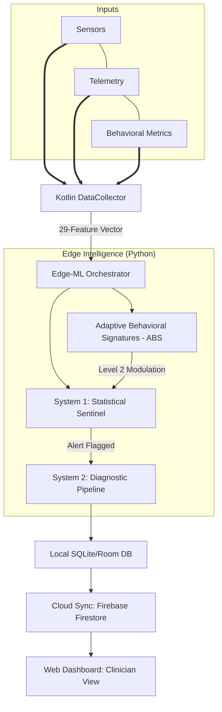

# MHealth System Architecture

> [!NOTE]
> This document provides a high-level overview. For the professional matrix-style diagram and technical specifications, refer to the **[System Architecture Master](./System_Architecture_Master.md)**.

## 1. System Matrix
The following diagram illustrates the relationship between **Contextual Inputs (Horizontal)** and the **Processing Workflow (Vertical)**.

### Figure 1: MHealth Scientific Multi-Layer Architecture

The MHealth (Mental Health Detection) platform utilizes a secure **Edge-ML** architecture. All data analysis is computed locally on the user's Android device via an embedded Python engine (Chaquopy), ensuring that sensitive raw sensor data is never transmitted to the cloud.

---

## 2. Top-Level Data Flow

The architecture follows a matrix-style flow where behavioral domains serve as horizontal inputs to a vertical processing pipeline.

---

## 2. Behavioral Domain Matrix

The system maps local telemetry into **29 features** across 7 primary behavioral groups:

| Group | Features Measured | Clinical Objective |
| :--- | :--- | :--- |
| **A: Screen & App** | Unlocks, Launch counts, Notifications | Monitor engagement and digital dependency. |
| **B: Communication** | Call density, Conversation frequency | Identify social surges or withdrawals. |
| **C: Movement** | Displacement, Entropy, Home Ratio | Detect motor retardation or erratic movement. |
| **D: Chronobiology** | Dark Duration, Sleep Interruption | Capture circadian rhythm shifts. |
| **E: System Usage** | Charge Duration, Storage, Network | Proxies for device attachment/detachment. |
| **F: Instrumental** | UPI launches, App Churn, Installs | Measure impulsivity and organizational flow. |
| **G: Active/Passive** | Steps, Media usage, Audio hours | Differentiate active focus from sedentary modes. |

---

## 3. Intelligence Layers

### 3.1 Adaptive Behavioral Signatures (ABS)
The system constructs **Personalized Identity Scaffolding** for each user during a 28-day calibration window. Utilizing optimized **Clinical-Weighted PCA + Mean-Shift clustering**, the system identifies **Behavioral Baseline Clusters** (e.g., Workday, Weekend, Travel) to modulate alert sensitivity. 

Today's behavior is compared against these anchors to adjust the sensitivity of the AI:
- **Routine Match**: Small deviations are suppressed (high coherence).
- **Routine Deviation**: Deviations in unknown territory are amplified (low coherence).

### 3.2 System 1: Statistical Anomaly Engine
System 1 acts as the first responder, calculating the **Magnitude** ($70\%$) and **Velocity** ($30\%$) of behavioral change. It uses a cumulative evidence threshold ($> 0.38$) to prevent false positives from single-day outliers.

### 3.3 System 2: Clinical Diagnostic Pipeline
When a significant anomaly is flagged, it is passed through a 6-phase diagnostic journey to label the pattern:
- **Phase 1-2**: Saturation screening and Life Event filtering (e.g., travel).
- **Phase 3-4**: Comparison against **Clinical Archetypes** (Depression, Mania, etc.) using Weighted Euclidean Distance, overseen by hard-coded Clinical Guardrails.
- **Phase 5-6**: Generation of human-readable **Explainability Narratives** for the clinician.

---

## 4. Clinician Oversight
Results are synced via **Firebase** to the Admin Dashboard, where clinicians can prioritize patients based on their alert status and view the specific behavioral deconstruction behind every alert.
