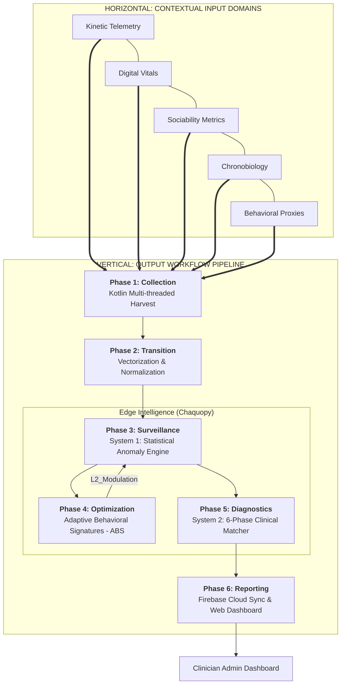

# MHealth: Professional System Architecture Master

This master architecture document defines the multimodal data flow and the edge-intelligence pipeline of the MHealth platform. The system is designed as a **Matrix Architecture**, where various behavioral domains serve as horizontal inputs into a vertically integrated clinical processing stack.

---

## 1. System Matrix
The following diagram illustrates the relationship between **Contextual Inputs (Horizontal)** and the **Processing Workflow (Vertical)**.

### Figure 1: MHealth Scientific Multi-Layer Architecture

---

## 2. Horizontal: Input Domain Specifications

The platform ingests **31 distinct metrics** across five core behavioral domains:

| Domain | Key Metrics | Clinical Objective |
| :--- | :--- | :--- |
| **Kinetic Telemetry** | Displacement, Entropy, Home Ratio, Steps | Detect motor retardation or manic pacing. |
| **Digital Vitals** | Unlocks, Screen Time, Session Flow | Monitor digital dependency and focus. |
| **Sociability** | Call Density, Contact Diversity, Social App Ratio | Identify social withdrawal or hyper-sociability. |
| **Chronobiology** | Dark Duration, Sleep Interruption, Wake Stability | Track circadian rhythm dissolution. |
| **Behavioral Proxies** | App Churn, UPI Activity, Calendar Density | Measure impulsivity and organizational integrity. |

---

## 3. Vertical: Analysis & Logic Flow

### 3.1 Adaptive Behavioral Signatures (ABS)
The system constructs **Personalized Identity Scaffolding** for each user during a 28-day calibration window. Utilizing optimized K-Means clustering, the system identifies **Behavioral Baseline Clusters** (e.g., Workday, Weekend, Travel) to modulate alert sensitivity. 

If a user follows an established healthy Signature, alert magnitude is **suppressed**. If behavior deviates into an unknown "Negative Texture" area, the magnitude is **amplified**.

### 3.2 System 1: The Statistical Sentinel
System 1 calculates the **Magnitude** ($70\%$) and **Velocity** ($30\%$) of behavioral shifts. It uses an **Evidence Accumulator** to ensure that only sustained deviations trigger clinical alerts, effectively filtering out one-off outliers.

### 3.3 System 2: Clinical Prototype Matching
Once a significant shift is flagged, it is passed through a 6-stage diagnostic pipeline:
1. **Saturation Check**: Ensures the baseline was not captured during a pre-existing episode.
2. **Context Filter**: Removes noise from life events (e.g., travel).
3. **Similarity Engine**: Uses Weighted Euclidean Distance to match the user's deviation vector to **Clinical Archetypes** (Depression, Mania, Anxiety, Bipolar).
4. **Guardrail Validation**: Hard-coded constraints based on clinical literature.
5. **Narrative Generation**: Translates Z-scores into human-readable clinical explanations.

---

## 4. Output Hub: Clinician Web Dashboard
All edge-computed summaries are synced via **Firebase Firestore** to a centralized administrative dashboard. This provides:
- **Red/Orange/Green Alert Prioritization** for patient caseloads.
- **Explainability Deconstruction**: Breaks down exactly which behavioral metrics led to the alert.
- **Historical Comparison**: Compares the current "Adaptive Signature" against the initial healthy baseline.
