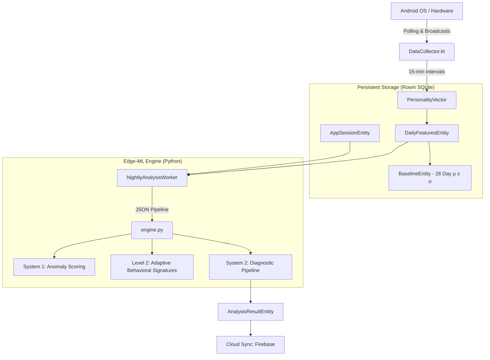

# MHealth — Complete Data Extraction Reference

> End-to-end specification of every data point collected, how it is sourced,
> computed, stored, and used in the ML pipeline.

---

## Architecture Overview



---

## Collection Schedule

| Trigger | Interval | Action |
|---|---|---|
| `MonitoringService.scheduleMonitoring()` | Every 15 min | `collectSnapshot()` → Update Live UI |
| `MonitoringService` Midnight Rollover | Daily at 00:05 | Save `DailyFeaturesEntity` to Room |
| `NightlyAnalysisWorker` (WorkManager) | Daily at 00:05 | Run Python engine, save results |
| `Adaptive GPS Capture` | Variable ($1-15$ min) | Append GPS fix to daily track |

---

## Feature-by-Feature Extraction

### Group 1 — Digital Engagement

#### 1. `screenTimeHours`
- **What**: Total foreground time for all non-system apps today.
- **API**: `UsageStatsManager.queryEvents(startOfDay, now)`
- **Events**: `MOVE_TO_FOREGROUND (1)` / `MOVE_TO_BACKGROUND (2)` pairs.
- **Formula**: $\sum (backgroundTime - foregroundTime)$
- **Unit**: Hours (Float)

#### 2. `unlockCount`
- **What**: Number of successful device unlocks today.
- **API**: `UsageStatsManager` Type 18: `KEYGUARD_HIDDEN`.
- **Formula**: Count of event type 18 since `startOfDay`.

#### 3. `appLaunchCount`
- **What**: Distinct non-system app foregrounding events.
- **API**: `UsageStatsManager` Type 1: `MOVE_TO_FOREGROUND`.
- **Debounce**: Requires $> 1,500$ms in background between launches (prevents UI flicker noise).

#### 4. `notificationsToday`
- **What**: Total notification interruptions today.
- **API**: `UsageStatsManager` Type 12: `NOTIFICATION_INTERRUPTION`.

#### 5. `socialAppRatio`
## Storage Flow

```
collectSnapshot()
    │
    ├─ PersonalityVector (in-memory, updated every 15 min)
    │       → DataRepository.latestVector (StateFlow → live UI)
    │
    ├─ At day rollover (midnight):
    │       ↓
    │   DailyFeaturesEntity (Room: daily_features table)
    │       ↓
    │   BaselineEntity (Room: baseline table) — after 28 days
    │       ↓
    │   Firebase Firestore (cloud backup)
    │
    └─ NightlyAnalysisWorker (00:05 daily):
            ↓
        JsonConverter.toEngineJson()
            ↓
        PythonEngine.runAnalysis()
            ↓
        AnalysisResultEntity (Room: analysis_results table)
```

---

## Baseline Building (28-Day Period)

- One `DailyFeaturesEntity` saved per calendar day
- After 28 days: `MonitoringService.persistBaselineToRoom()` computes:
  - `μ (mean)` = average over 28 days for each feature
  - `σ (std dev)` = standard deviation over 28 days
- Both stored as `BaselineEntity` rows (one per feature)
- Baseline also uploaded to Firestore for cloud recovery

---

## ML Model Feature Dimensions

| Category | Features | Count |
|---|---|---|
| Screen/App | screenTime, unlocks, launches, notifications, socialRatio | 5 |
| Communication | calls, callDuration, uniqueContacts, convFrequency | 4 |
| Location | displacement, entropy, homeRatio, places | 4 |
| Sleep | sleepDuration, sleepTime, wakeTime, darkHours | 4 |
| System | charge, memory, wifi, mobile, storage | 5 |
| New Expanded | downloads, appInstalls, appUninstalls, UPI, nightChecks | 5 |
| Previously missing | mediaCount, calendarEvents | 2 |
| **Total** | | **29** |

---

## Required Android Permissions

| Permission | Features Using It |
|---|---|
| `PACKAGE_USAGE_STATS` | All screen/app/sleep features via UsageStatsManager |
| `READ_CALL_LOG` | callsPerDay, callDuration, uniqueContacts |
| `READ_CONTACTS` | uniqueContacts fallback |
| `ACCESS_FINE_LOCATION` | displacement, entropy, homeRatio, places |
| `ACTIVITY_RECOGNITION` | Step counter (TYPE_STEP_COUNTER sensor) |
| `READ_MEDIA_IMAGES` | mediaCountToday, downloadsToday |
| `READ_CALENDAR` | calendarEventsToday |
| `FOREGROUND_SERVICE` | MonitoringService (keeps collection alive) |
| `NETWORK_STATS` | networkWifiMB, networkMobileMB |

