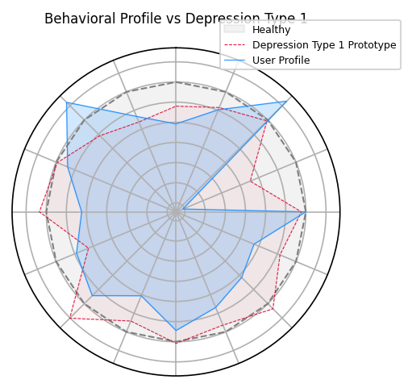
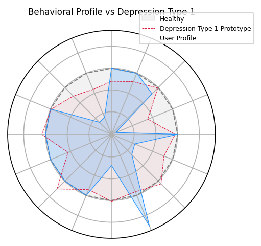
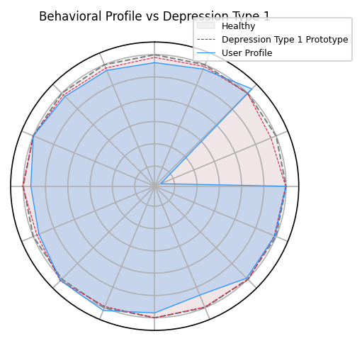
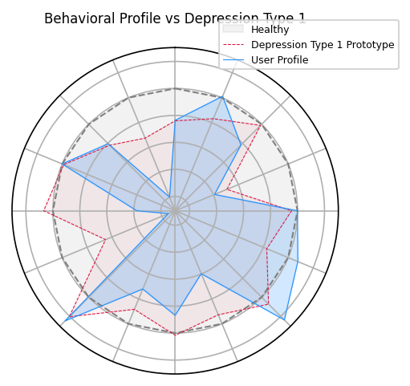
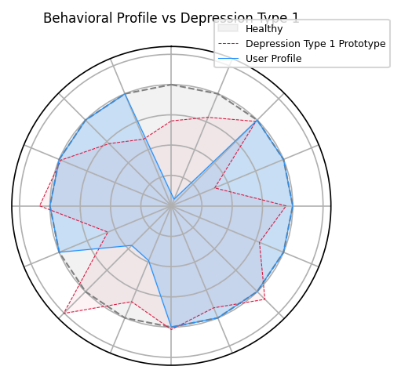
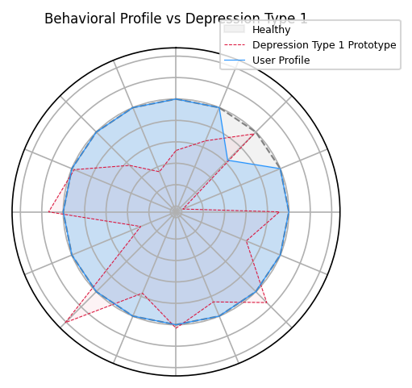
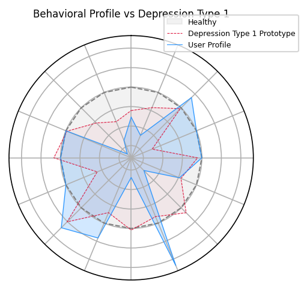

# System 2: Depressed Students Pattern Analysis

**Total Depressed Students Found:** 7 (Ground truth: Depressed)

## Student Profile: U16
### System 1: Anomaly Triggered
> **Baseline Break Detected**: System 1 flagged a structural deviation.
- **Global Anomaly Score:** `0.395 SD`
- **Sustained Deviation:** `27 days`
- **Trigger Pattern:** `Stable`

### System 2: Prototype Classification
- **Matched Pattern Prototype:** `Depression Type 1`
- **System 2 Match Score:** `0.78` / 1.0

#### Top Behavioral Changes Analysis
| Feature | Anomaly Deviation | Pattern Match Rate |
|---|---|---|
| Calls Per Day | **-3.04 SD** | Matches Expected (-1.2 SD) |
| Daily Displacement Km | **-1.13 SD** | Matches Expected (-0.4 SD) |
| Wake Time Hour | **-0.97 SD** | Matches Expected (-0.3 SD) |
| Conversation Frequency | **-0.66 SD** | Matches Expected (-0.8 SD) |
| Screen Time Hours | **-1.04 SD** | Matches Expected (-0.6 SD) |
| Home Time Ratio | **-0.65 SD** | Matches Expected (-0.2 SD) |
| Unlock Count | **-0.48 SD** | Matches Expected (-0.4 SD) |
| Charge Duration Hours | **-0.31 SD** | Matches Expected (-0.0 SD) |
| Sleep Duration Hours | **-0.55 SD** | Matches Expected (-0.9 SD) |

---

## Student Profile: U17
### System 1: Anomaly Triggered
> **Baseline Break Detected**: System 1 flagged a structural deviation.
- **Global Anomaly Score:** `0.323 SD`
- **Sustained Deviation:** `4 days`
- **Trigger Pattern:** `Stable`

### System 2: Prototype Classification
- **Matched Pattern Prototype:** `Depression Type 1`
- **System 2 Match Score:** `0.69` / 1.0

#### Top Behavioral Changes Analysis
| Feature | Anomaly Deviation | Pattern Match Rate |
|---|---|---|
| Conversation Duration Hours | **-2.26 SD** | Matches Expected (-0.6 SD) |
| Conversation Frequency | **-2.20 SD** | Matches Expected (-0.8 SD) |
| Daily Displacement Km | **-1.88 SD** | Matches Expected (-0.4 SD) |
| Calls Per Day | **-2.82 SD** | Matches Expected (-1.2 SD) |
| Social App Ratio | **-0.40 SD** | Matches Expected (-0.0 SD) |

---

## Student Profile: U18
### System 1: Anomaly Triggered
> **Baseline Break Detected**: System 1 flagged a structural deviation.
- **Global Anomaly Score:** `0.414 SD`
- **Sustained Deviation:** `13 days`
- **Trigger Pattern:** `Unstable/Cycling`

### System 2: Prototype Classification
- **Matched Pattern Prototype:** `Depression Type 1`
- **System 2 Match Score:** `0.62` / 1.0

#### Top Behavioral Changes Analysis
| Feature | Anomaly Deviation | Pattern Match Rate |
|---|---|---|
| Calls Per Day | **-28.03 SD** | Matches Expected (-1.2 SD) |
| Home Time Ratio | **-3.06 SD** | Matches Expected (-0.2 SD) |
| Conversation Frequency | **-1.38 SD** | Matches Expected (-0.8 SD) |
| Conversation Duration Hours | **-1.02 SD** | Matches Expected (-0.6 SD) |
| Screen Time Hours | **-1.79 SD** | Matches Expected (-0.6 SD) |
| Daily Displacement Km | **-0.30 SD** | Matches Expected (-0.4 SD) |
| Unlock Count | **-1.06 SD** | Matches Expected (-0.4 SD) |
| Sleep Duration Hours | **-1.36 SD** | Matches Expected (-0.9 SD) |
| Sleep Time Hour | **+0.39 SD** | Matches Expected (+0.5 SD) |

---

## Student Profile: U23
### System 1: Anomaly Triggered
> **Baseline Break Detected**: System 1 flagged a structural deviation.
- **Global Anomaly Score:** `0.358 SD`
- **Sustained Deviation:** `23 days`
- **Trigger Pattern:** `Stable`

### System 2: Prototype Classification
- **Matched Pattern Prototype:** `Depression Type 1`
- **System 2 Match Score:** `0.80` / 1.0

#### Top Behavioral Changes Analysis
| Feature | Anomaly Deviation | Pattern Match Rate |
|---|---|---|
| Conversation Frequency | **-1.99 SD** | Matches Expected (-0.8 SD) |
| Calls Per Day | **-1.48 SD** | Matches Expected (-1.2 SD) |
| Home Time Ratio | **-1.01 SD** | Matches Expected (-0.2 SD) |
| Wake Time Hour | **-0.70 SD** | Matches Expected (-0.3 SD) |
| Conversation Duration Hours | **-0.51 SD** | Matches Expected (-0.6 SD) |
| Screen Time Hours | **-0.59 SD** | Matches Expected (-0.6 SD) |
| Location Entropy | **+0.59 SD** | Matches Expected (+0.2 SD) |
| Sleep Duration Hours | **-2.13 SD** | Matches Expected (-0.9 SD) |
| Sleep Time Hour | **+0.62 SD** | Matches Expected (+0.5 SD) |
| Social App Ratio | **-0.54 SD** | Matches Expected (-0.0 SD) |

---

## Student Profile: U33
### System 1: Anomaly Triggered
> **Baseline Break Detected**: System 1 flagged a structural deviation.
- **Global Anomaly Score:** `0.38 SD`
- **Sustained Deviation:** `9 days`
- **Trigger Pattern:** `Stable`

### System 2: Prototype Classification
- **Matched Pattern Prototype:** `Depression Type 1`
- **System 2 Match Score:** `0.82` / 1.0

#### Top Behavioral Changes Analysis
| Feature | Anomaly Deviation | Pattern Match Rate |
|---|---|---|
| Screen Time Hours | **-1.80 SD** | Matches Expected (-0.6 SD) |
| Wake Time Hour | **-1.02 SD** | Matches Expected (-0.3 SD) |
| Unlock Count | **-1.88 SD** | Matches Expected (-0.4 SD) |

---

## Student Profile: U52
### System 1: Anomaly Triggered
> **Baseline Break Detected**: System 1 flagged a structural deviation.
- **Global Anomaly Score:** `0.426 SD`
- **Sustained Deviation:** `10 days`
- **Trigger Pattern:** `Unstable/Cycling`

### System 2: Prototype Classification
- **Matched Pattern Prototype:** `Depression Type 1`
- **System 2 Match Score:** `0.80` / 1.0

#### Top Behavioral Changes Analysis
| Feature | Anomaly Deviation | Pattern Match Rate |
|---|---|---|
| Social App Ratio | **-0.46 SD** | Matches Expected (-0.0 SD) |

---

## Student Profile: U53
### System 1: Anomaly Triggered
> **Baseline Break Detected**: System 1 flagged a structural deviation.
- **Global Anomaly Score:** `0.337 SD`
- **Sustained Deviation:** `12 days`
- **Trigger Pattern:** `Stable`

### System 2: Prototype Classification
- **Matched Pattern Prototype:** `Depression Type 1`
- **System 2 Match Score:** `0.77` / 1.0

#### Top Behavioral Changes Analysis
| Feature | Anomaly Deviation | Pattern Match Rate |
|---|---|---|
| Conversation Duration Hours | **-1.67 SD** | Matches Expected (-0.6 SD) |
| Conversation Frequency | **-1.33 SD** | Matches Expected (-0.8 SD) |
| Daily Displacement Km | **-0.47 SD** | Matches Expected (-0.4 SD) |
| Screen Time Hours | **-0.77 SD** | Matches Expected (-0.6 SD) |
| Unlock Count | **-1.19 SD** | Matches Expected (-0.4 SD) |
| Sleep Time Hour | **+0.72 SD** | Matches Expected (+0.5 SD) |

---
