# System 2: Metric-Based Clinical Prototype Matching — Full Report

> **Project**: Early Risk Detection of Mental Health Disorders  
> **Component**: System 1 (Anomaly Detection) + System 2 (Disorder Characterization)  
> **Date**: 2026-03-02  
> **Status**: S1+S2 Integration Complete ✅ | Voice Features Removed ✅ | 30/30 Tests Passing ✅

---

## Table of Contents

1. [Executive Summary](#1-executive-summary)
2. [What Is System 2?](#2-what-is-system-2)
3. [Architecture Overview](#3-architecture-overview)
4. [Phase 0: Population Norms & Disorder Prototypes](#4-phase-0-population-norms--disorder-prototypes)
5. [Phase 1: Baseline Screener (3-Gate Filter)](#5-phase-1-baseline-screener-3-gate-filter)
6. [Phase 2: Distance Scoring Engine](#6-phase-2-distance-scoring-engine)
7. [Phase 3: Temporal Shape Validator](#7-phase-3-temporal-shape-validator)
8. [Phase 4: Life Event Filter](#8-phase-4-life-event-filter)
9. [Phase 5: Explainability Engine](#9-phase-5-explainability-engine)
10. [Phase 6: Full Pipeline Integration](#10-phase-6-full-pipeline-integration)
11. [File-by-File Breakdown](#11-file-by-file-breakdown)
12. [How to Use — Usage Guide](#12-how-to-use--usage-guide)
13. [Test Results](#13-test-results)
14. [Limitations & Next Steps](#14-limitations--next-steps)

---

## 1. Executive Summary

System 2 is a **fully interpretable, metric-driven, training-data-free** disorder classification engine. Unlike traditional ML classifiers that require large labeled datasets and produce black-box predictions, System 2 uses **clinical prototype matching** — comparing a user's behavioral deviation pattern against clinically-grounded disorder prototypes using geometric distance.

**Key capabilities:**
- Classifies deviations into 7 profiles: Healthy, Depression, Schizophrenia, BPD, Bipolar (Depressive), Bipolar (Manic), Anxiety
- Detects contaminated baselines before they corrupt the system
- Validates classifications using temporal trajectory analysis
- Filters out life events from clinical concerns
- Produces fully explainable outputs with radar chart visualizations

**Implementation:** 9 Python modules (+ 1 adapter), 30 passing tests, 11 visualization charts.

**Recent changes (2026-03-02):**
- System 1 voice features fully removed (18 behavioral features only)
- S1 → S2 adapter module created (`s1_s2_adapter.py`)
- Gate 3 redesign: contaminated baselines now reported as **early detections** (not replaced)
- S2Output enriched with `baseline_contaminated` and `onboarding_detection` fields

---

## 2. What Is System 2?

### The Problem System 2 Solves

System 1 (the anomaly detection engine) monitors user behavior and detects deviations from their personal baseline. However, System 1 can only say *"something changed"* — it cannot determine:

1. **What changed** — Is this depression? Anxiety? Bipolar? A life event?
2. **Is the baseline trustworthy?** — Was the user already depressed during onboarding?
3. **Is it clinically significant?** — Or is it just exam week?

System 2 answers all three questions using a **prototype matching** approach.

### Why Not a Traditional ML Classifier?

| Aspect | ML Classifier | Prototype Matching (System 2) |
|---|---|---|
| Training data needed | Large labeled dataset per disorder | None — clinical knowledge only |
| New disorders | Retrain entire model | Add one prototype vector |
| Interpretability | Black box | Every decision fully explainable |
| Confidence handling | Overconfident softmax | Natural distance threshold |
| Unknown disorders | Force-fits into known class | "Unclassified" output |
| Clinician adjustable | Cannot adjust without retraining | Edit prototype weights directly |
| Comorbidity | Single output | Multiple match scores shown |

---

## 3. Architecture Overview

```
System 1 (Anomaly Detected)
         │
         ▼
┌─────────────────────────────────────┐
│  BASELINE SCREENER (Phase 1)        │
│  ┌───────────────────────────────┐  │
│  │ Gate 1: Population Anchor     │  │  ← Day 7
│  │ Gate 2: Stability Check       │  │  ← Day 14-21
│  │ Gate 3: Prototype Proximity   │  │  ← Day 28
│  └───────────────────────────────┘  │
│  Output: Frame 1 or Frame 2        │
└──────────────┬──────────────────────┘
               ▼
┌─────────────────────────────────────┐
│  LIFE EVENT FILTER (Phase 4)        │
│  • Co-deviating features ≤ 2?       │
│  • Self-resolved in 10 days?        │
│  • Max deviation < 1.5 SD?          │
│  Output: DISMISS / PROCEED          │
└──────────────┬──────────────────────┘
               ▼
┌─────────────────────────────────────┐
│  PROTOTYPE MATCHER (Phase 2)        │
│  • Cosine Similarity (shape)        │
│  • Weighted Euclidean (magnitude)   │
│  • Combined: 0.6×cos + 0.4×inv_d   │
│  Output: Ranked match scores        │
└──────────────┬──────────────────────┘
               ▼
┌─────────────────────────────────────┐
│  TEMPORAL VALIDATOR (Phase 3)       │
│  • Detect trajectory shape          │
│  • Check shape-disorder compat      │
│  • Boost (×1.2) or downgrade (×0.6) │
│  Output: Adjusted confidence        │
└──────────────┬──────────────────────┘
               ▼
┌─────────────────────────────────────┐
│  EXPLAINABILITY ENGINE (Phase 5)    │
│  • Top 3 contributing features      │
│  • Natural language narrative       │
│  • Radar chart visualization        │
│  Output: Human-readable report      │
└──────────────┬──────────────────────┘
               ▼
         S2 OUTPUT
  Case A (Clean Baseline):
    "Consistent with [Disorder] — X% confidence"
  Case B (Contaminated Baseline):
    "[ONBOARDING DETECTION] Depression detected during
     baseline period (confidence: 78%)"
```

---

## 4. Phase 0: Population Norms & Disorder Prototypes

### 4.1 The 18 Behavioral Features

System 2 tracks 18 behavioral features. **Voice features are fully excluded** — both System 1 and System 2 operate on behavioral data only:

| # | Feature | Description | Unit |
|---|---|---|---|
| 1 | `screen_time_hours` | Total daily screen time | hours |
| 2 | `unlock_count` | Phone unlocks per day | count |
| 3 | `social_app_ratio` | Fraction of time in social apps | ratio |
| 4 | `calls_per_day` | Phone calls made/received | count |
| 5 | `texts_per_day` | SMS/messages sent | count |
| 6 | `unique_contacts` | Distinct contacts communicated with | count |
| 7 | `response_time_minutes` | Average message response time | minutes |
| 8 | `daily_displacement_km` | GPS displacement per day | km |
| 9 | `location_entropy` | Diversity of visited locations | entropy |
| 10 | `home_time_ratio` | Fraction of day spent at home | ratio |
| 11 | `places_visited` | Unique places visited per day | count |
| 12 | `wake_time_hour` | Typical wake time | hour |
| 13 | `sleep_time_hour` | Typical sleep time | hour |
| 14 | `sleep_duration_hours` | Total sleep duration | hours |
| 15 | `dark_duration_hours` | Phone screen-off duration at night | hours |
| 16 | `charge_duration_hours` | Daily charging duration | hours |
| 17 | `conversation_duration_hours` | Face-to-face conversation time | hours |
| 18 | `conversation_frequency` | Number of face-to-face conversations | count |

### 4.2 Population Norms

Population norms represent the **healthy baseline reference** — what typical healthy behavior looks like according to the StudentLife dataset (low-PHQ-9 cohort, score < 5) and published literature.

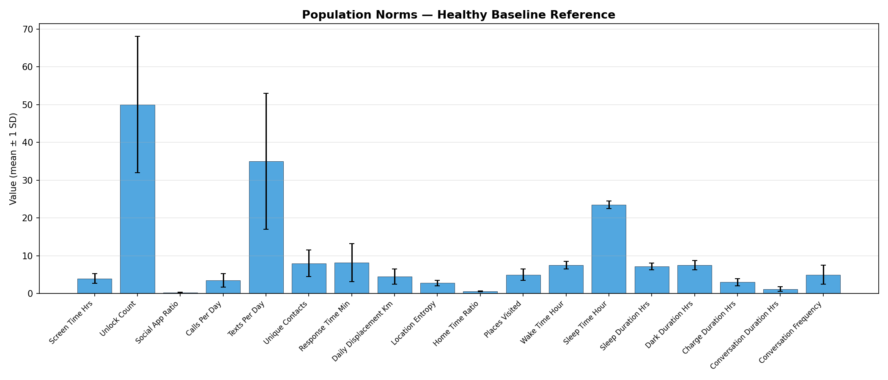

Each bar shows the mean value with ±1 standard deviation error bars.  These norms serve as the "anchor" for Frame 1 comparisons and Gate 1 screening.

### 4.3 Frame 1 — Disorder Prototypes (Absolute Values)

Frame 1 prototypes define what each disorder's behavior looks like in **absolute terms** — used during onboarding (Days 1-28) when we don't yet trust the user's personal baseline.

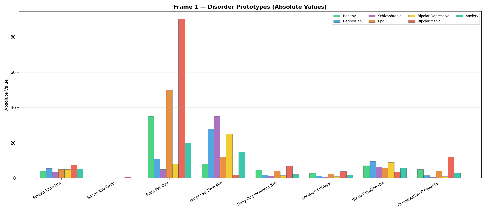

Key observations:
- **Depression**: High screen time, very low displacement & texts, high response time
- **Bipolar Manic**: Extremely high texts/day, unlock count, and displacement (hyperactivity)
- **Schizophrenia**: Lowest social app ratio and location entropy (severe isolation)
- **BPD**: Values close to healthy means but with high *variance* (captured in Frame 2)

### 4.4 Frame 2 — Disorder Prototypes (Z-Scores)

Frame 2 prototypes express expected deviations as **standard deviations from the user's own verified-clean baseline** — this is the personalized reference used during ongoing monitoring.

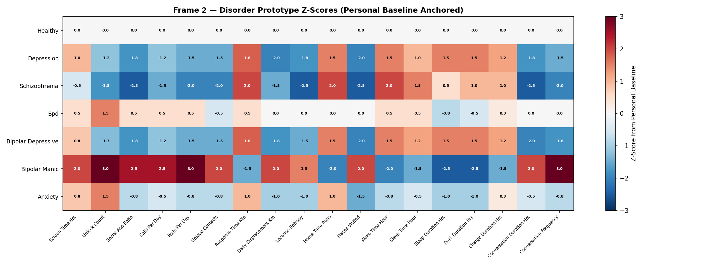

Reading the heatmap:
- **Blue** = negative deviation (less than baseline)
- **Red** = positive deviation (more than baseline)
- **White** = near zero (no change)

Notice how:
- **Depression** shows consistent blue (withdrawal) across social/mobility features and red (increase) in sleep/response time
- **Bipolar Manic** is the mirror — strong red in social/mobility, strong blue in sleep
- **BPD** is mostly near zero because BPD manifests as *variance*, not sustained direction
- **Healthy** is all zeros by definition

### 4.5 Feature Diagnostic Weights

Not all features are equally important for diagnosis. The weights prioritize features with stronger clinical evidence:

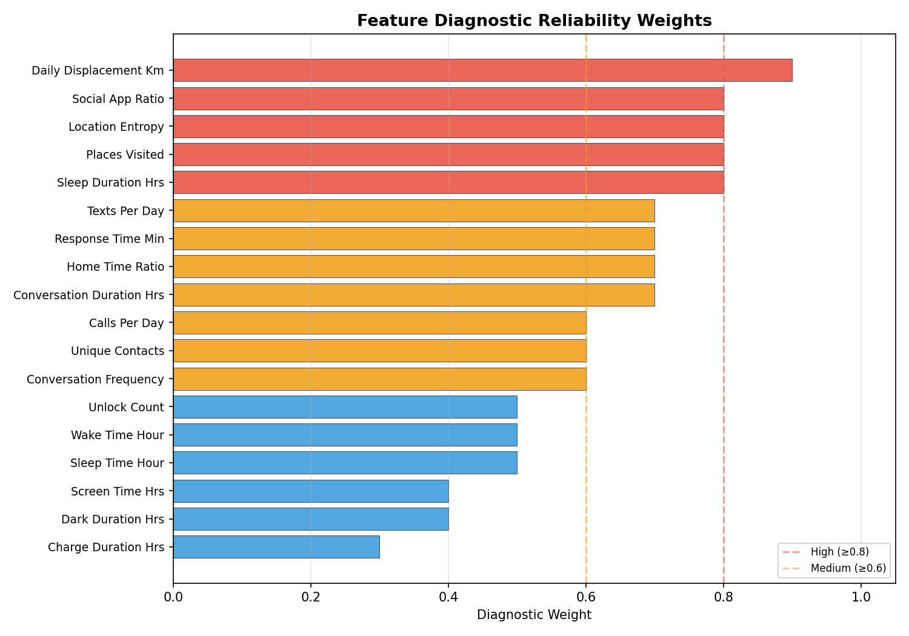

- **High weight** (≥0.8): `daily_displacement_km`, `location_entropy`, `places_visited`, `sleep_duration_hours`, `social_app_ratio` — these are the most diagnostically reliable markers with the strongest evidence from Saeb 2015 and Canzian 2015
- **Medium weight** (0.6-0.8): Communication features, response time
- **Low weight** (<0.6): `charge_duration_hours`, `dark_duration_hours` — indirect proxies

### 4.6 Two Reference Frames — The Critical Design Decision

```
                ONBOARDING (Days 1-28)          MONITORING (Day 28+)
                ┌────────────────────┐          ┌────────────────────┐
  Reference:    │ FRAME 1            │          │ FRAME 2            │
                │ Population norms   │          │ Personal baseline  │
                │ (absolute values)  │          │ (z-scores)         │
                └────────────────────┘          └────────────────────┘
  Purpose:      Catch pre-existing              Detect new changes
                conditions                      personalized to user
  Why:          Can't trust personal            Baseline verified ✓
                baseline yet                    Introverts ≠ extroverts
```

If the baseline **fails** Gate screening → the system falls back to Frame 1 for ongoing monitoring too.

---

## 5. Phase 1: Baseline Screener (3-Gate Filter)

The screener runs during onboarding (Days 1-28) using Frame 1 (population norms). It protects against the **contaminated baseline problem** — if a user onboards while already depressed, their depressed state gets recorded as "normal" and everything downstream is inverted.

### 5.1 How the 3 Gates Work

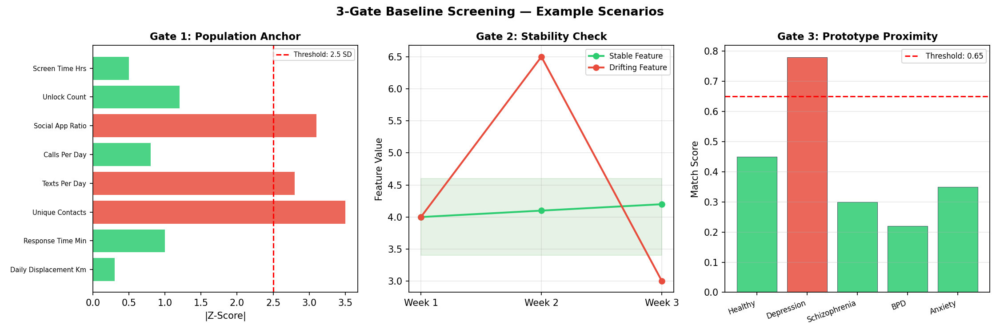

**Gate 1 — Population Anchor Check (Day 7)**

After 7 days of data, compute population z-scores for each feature:

```
z_pop = (user_value - population_mean) / population_std
```

If **3 or more features** simultaneously exceed **±2.5 SD** → flag as possible pre-existing condition.

*Example*: In the chart above, Screen Time (+3.1 SD), Texts/Day (+2.8 SD), and Unique Contacts (+3.5 SD) all exceed the threshold → Gate 1 fires.

**Gate 2 — Internal Stability Check (Days 14-21)**

A healthy person's behavior should be **stable** week-over-week. Compute weekly means and check if the standard deviation across weeks exceeds 1.5× the expected population drift.

*Example*: The chart shows a "drifting feature" that swings from 4.0 to 6.5 to 3.0 across three weeks — this instability flags cycling disorders like BPD or bipolar.

**Gate 3 — Prototype Proximity Check (Day 28)**

Run the full Frame 1 prototype matching on the 28-day behavioral average. If the top match is **NOT healthy** and confidence **> 0.65** → the baseline is contaminated.

*Example*: The chart shows depression scoring 0.78 (above 0.65 threshold) — the baseline is confirmed contaminated.

### 5.2 Decision Matrix

| Gates That Fire | Action | Frame |
|---|---|---|
| None | ✅ Lock personal baseline | Frame 2 |
| Gate 1 only | Extend monitoring to 56 days | Frame 2 |
| Gate 2 only | Flag cycling disorder, continue | Frame 2 |
| Gate 3 | Replace with population baseline | **Frame 1** |
| Gate 1 + Gate 3 | Replace baseline + prompt self-report (PHQ-9) | **Frame 1** |
| All three | Flag for clinical review | **Frame 1** |

> **Important**: The user is never told their baseline was "contaminated." It's framed as: *"We're still learning your patterns and want to make sure we get it right."*

---

## 6. Phase 2: Distance Scoring Engine

### 6.1 How Scoring Works

The matcher computes a **combined match score** against every disorder prototype using two complementary distance measures:

**Cosine Similarity** (captures directional shape):
```
cos_sim(U, P) = (U · P) / (|U| × |P|)
Range: -1 to 1.  Higher = more similar shape.
```
This answers: *"Are the same features high and low?"*

**Weighted Euclidean Distance** (captures magnitude):
```
dist(U, P) = √( Σ wᵢ × (Uᵢ - Pᵢ)² )
Lower = closer match.
```
This answers: *"How far apart are the actual values?"*

**Combined Score**:
```
match_score = 0.6 × cos_sim + 0.4 × (1 / (1 + dist))
```

The 60/40 split prioritizes shape over magnitude — a user might show depression *shape* at different severity levels.

### 6.2 Confidence Thresholds

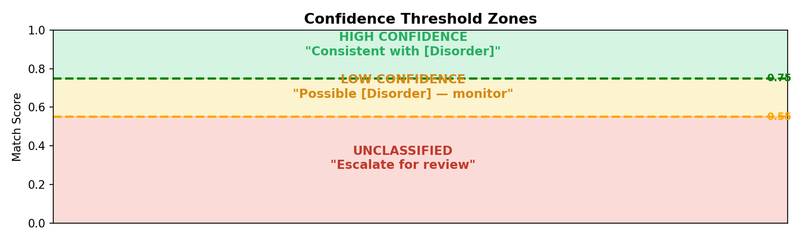

| Score Range | Tier | Output |
|---|---|---|
| ≥ 0.75 | **HIGH** | "Consistent with [Disorder] pattern" |
| 0.55 – 0.75 | **LOW** | "Possible [Disorder] — monitor" |
| < 0.55 | **UNCLASSIFIED** | "Uncertain — escalate for clinical review" |

The UNCLASSIFIED tier is **intentional** — the system openly admits uncertainty rather than force-fitting into a diagnosis. This is a fundamental advantage over ML classifiers that always output a softmax probability summing to 1.

### 6.3 Radar Chart — Visual Comparison

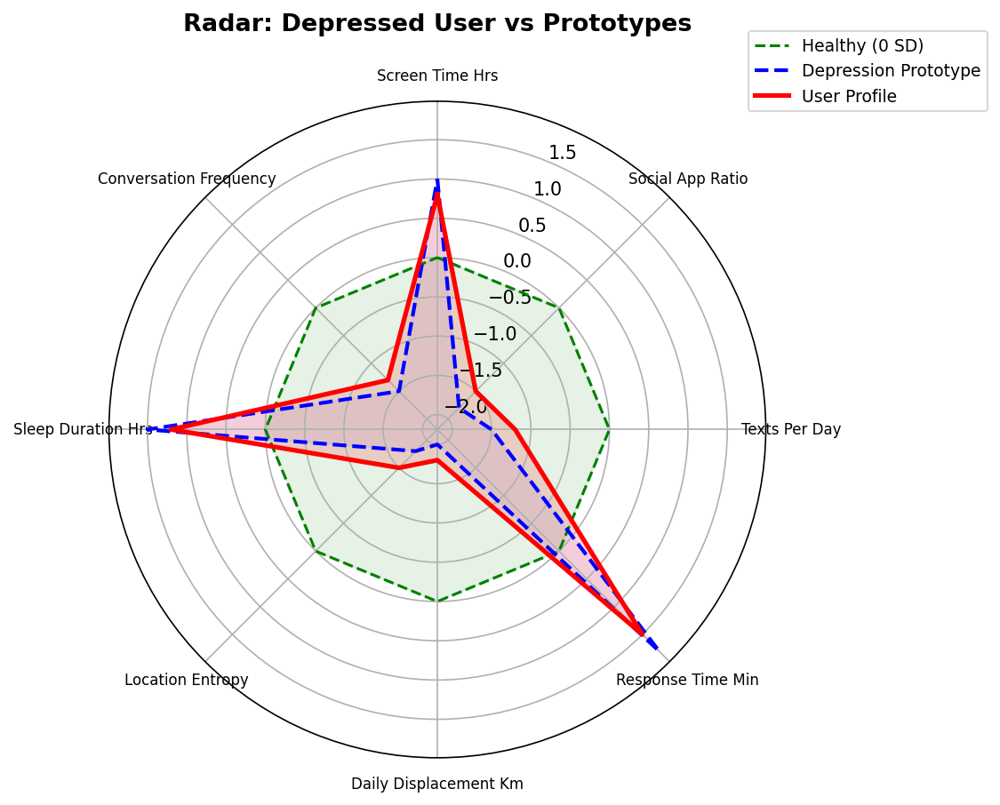

The radar chart shows a simulated depressed user (solid red) overlapping heavily with the depression prototype (dashed blue) while deviating significantly from the healthy baseline (dashed green, centered at 0). The overlap visually confirms the match.

### 6.4 All Disorder Prototypes

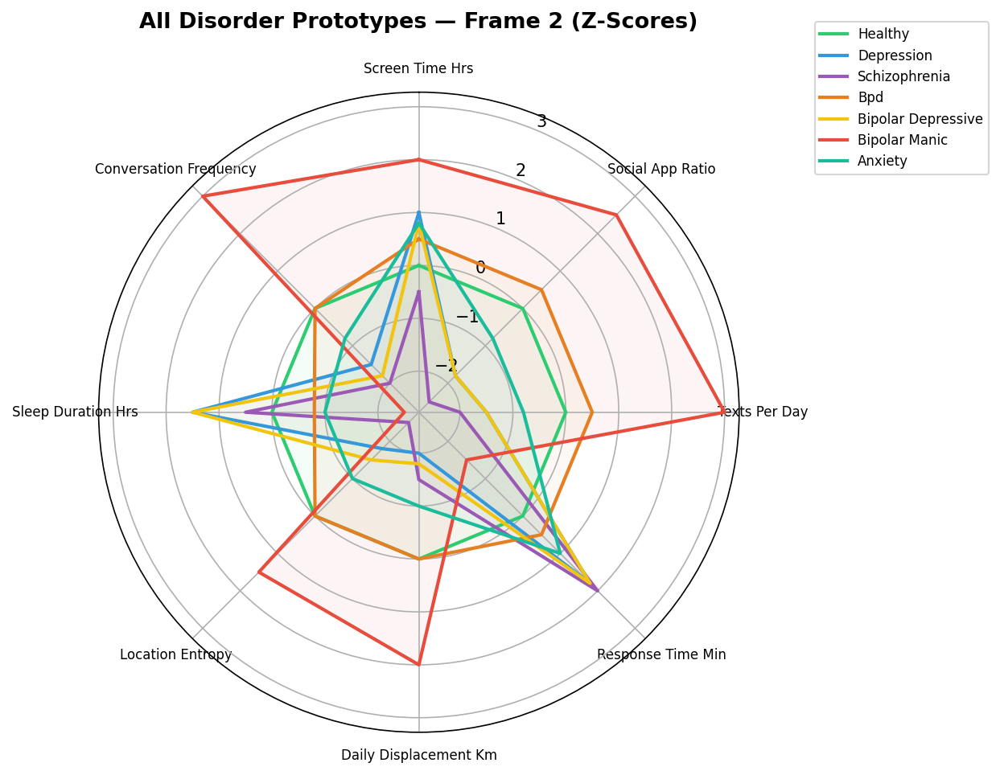

This overlay shows how different disorders create **different shapes** — this is what cosine similarity captures. Depression and Bipolar Depressive have similar shapes but different magnitudes. BPD is nearly flat (its signal is variance, not direction). Bipolar Manic is the mirror image of depression.

---

## 7. Phase 3: Temporal Shape Validator

### 7.1 Why Temporal Validation?

Distance scoring alone looks at a snapshot. But disorders have characteristic **temporal signatures** — depression drifts downward gradually, BPD oscillates rapidly, bipolar shows phase flips. By analyzing the anomaly score *trajectory* over 30-60 days, we can confirm or contradict the distance-based classification.

### 7.2 Five Detected Shapes

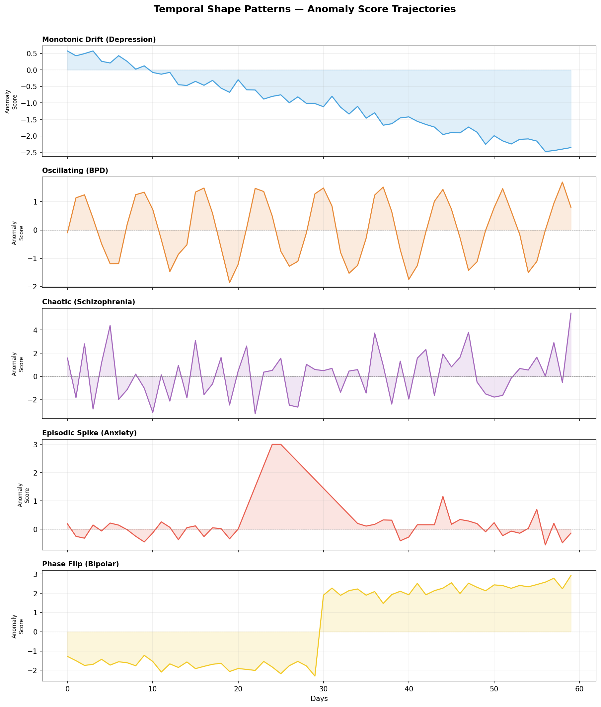

| Shape | Detection Method | Associated With |
|---|---|---|
| **Monotonic Drift** | Linear regression: slope < -0.02, R² > 0.6 | Depression, Bipolar Depressive |
| **Oscillating** | Autocorrelation peak at 3-10 day lag | BPD |
| **Chaotic** | High variance + low autocorrelation | Schizophrenia |
| **Episodic Spike** | Peak > 2 SD, recovers within 14 days | Anxiety, Life Events |
| **Phase Flip** | Weekly mean diff > 3 SD | Bipolar Manic |

### 7.3 Shape-Disorder Compatibility Matrix

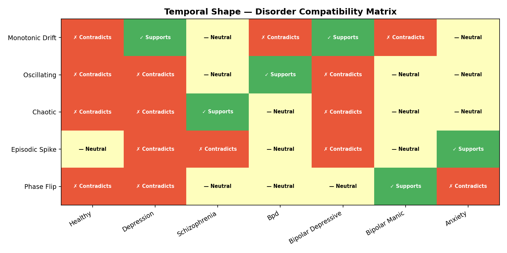

When the detected shape **supports** the classification → confidence is boosted by ×1.2  
When the detected shape **contradicts** the classification → confidence is downgraded by ×0.6

**Example**: If the matcher says "Depression" but the trajectory shows oscillating behavior → confidence drops from 0.70 to 0.42 (below UNCLASSIFIED threshold), and the system flags for review. This might indicate BPD misclassified as depression.

---

## 8. Phase 4: Life Event Filter

Before running the expensive classification pipeline, the Life Event Filter screens out obvious situational anomalies.

### Three Rules

| Rule | Threshold | Logic |
|---|---|---|
| **Co-deviation count** | ≤ 2 features | If only 1-2 features deviate, it's likely isolated (exam, breakup) |
| **Self-resolution** | ≤ 10 days | If the anomaly resolved quickly, it was transient |
| **Severity floor** | < 1.5 SD | If no feature exceeds 1.5 SD, too mild to classify |

If any rule triggers → **DISMISS** the anomaly as a likely life event.  
Otherwise → **PROCEED** to full classification.

---

## 9. Phase 5: Explainability Engine

### 9.1 Top Contributing Features

For each classification, the engine identifies the **top 3 features** driving the match. This is calculated as:

```
contribution(f) = weight(f) × |user_deviation(f)| × sign_agreement
```

Where `sign_agreement` = 1.0 if user and prototype deviate in the same direction, -0.5 if opposite.

### 9.2 Natural Language Narrative

A template-based output:

> *"Over the past 30 days, your behavioral patterns show significant changes in daily displacement, social app ratio, and texts per day. This pattern is consistent with Depression-like behavioral changes (confidence: 84%)."*

### 9.3 Radar Chart

Generated using matplotlib — overlays user profile, matched prototype, and healthy baseline on a spider chart. Clinicians can instantly see which prototype shape the user resembles.

---

## 10. Phase 6: Full Pipeline Integration

### 10.1 Pipeline Demo

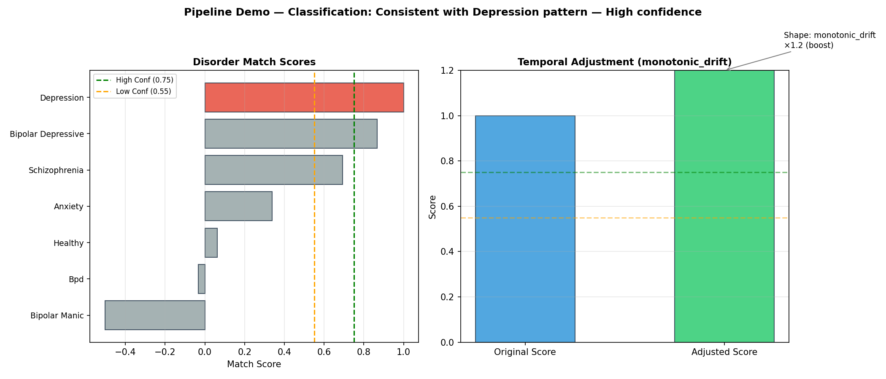

The left chart shows match scores against all disorders — Depression is the clear winner (red bar). The right chart shows the temporal adjustment: the monotonic drift shape confirmed the depression classification, boosting the score from 1.0 to 1.2 (×1.2 boost).

### 10.2 S1 → S2 Interface Contract

System 1 must pass exactly three data bundles to System 2:

```python
@dataclass
class S1Input:
    baseline_data: dict
    # Keys: "raw_7day", "weekly_windows" (3 dicts), "raw_28day"
    
    anomaly_report: AnomalyReport
    # feature_deviations: {feature: z-score}
    # days_sustained, co_deviating_count, resolved, days_since_onset
    
    anomaly_timeseries: list[float]
    # Daily anomaly scores for past 60 days
```

---

## 11. File-by-File Breakdown

### `system2/config.py` — Central Configuration

**What it does:** Defines all constants that the rest of the system depends on.

**Key contents:**
- `BEHAVIORAL_FEATURES` — list of 18 feature names
- `POPULATION_NORMS` — healthy mean/std per feature
- `POPULATION_EXPECTED_DRIFT` — expected week-over-week variance for healthy users
- `DISORDER_PROTOTYPES_FRAME1` — 7 disorder profiles as absolute values
- `DISORDER_PROTOTYPES_FRAME2` — 7 disorder profiles as z-scores
- `FEATURE_WEIGHTS` — diagnostic reliability weights (0-1)
- `GATE_PARAMS` — thresholds for the 3-gate screener
- `TEMPORAL_SHAPES` — detection parameters for each shape
- `SHAPE_DISORDER_MATRIX` — +1/0/-1 compatibility between shapes and disorders
- `CONFIDENCE_THRESHOLDS` — high (0.75), low (0.55)
- `TEMPORAL_BOOST/DOWNGRADE` — 1.2 / 0.6 multipliers

**Why it matters:** Separating all tunable parameters into one file means clinicians can adjust the system without touching code logic. Changing a population norm or prototype value only requires editing `config.py`.

---

### `system2/baseline_screener.py` — 3-Gate Contamination Filter

**What it does:** Runs during onboarding (Days 1-28) to catch contaminated baselines.

**Classes:**
- `GateResult` — enum: PASS, FLAG_POSSIBLE_CONDITION, FLAG_UNSTABLE_BASELINE, CONTAMINATED_BASELINE
- `RecommendedAction` — enum: LOCK_BASELINE, EXTEND_MONITORING, FLAG_CYCLING, EARLY_DETECTION, EARLY_DETECTION_WITH_SELF_REPORT, CLINICAL_REVIEW
- `ScreeningResult` — dataclass with gate results, flagged features, recommended action, selected frame
- `BaselineScreener` — main class

**Key methods:**
- `gate1_population_anchor(raw_7day)` → compares to population norms
- `gate2_stability_check(weekly_windows)` → checks week-over-week drift
- `gate3_prototype_proximity(raw_28day)` → runs Frame 1 matching
- `screen(raw_7day, weekly_windows, raw_28day)` → combines all gates + decision matrix

**How it works internally:**
1. Gate 1 computes `|z| = |value - mean| / std` for each feature
2. Gate 2 computes `std(week1_mean, week2_mean, week3_mean)` and compares to expected drift
3. Gate 3 builds user and prototype vectors, normalizes both to population z-scores, and computes the combined match score

**Decision matrix when Gate 3 fires:**
- Gate 3 only → `EARLY_DETECTION`: report disorder match as immediate finding, use Frame 1
- Gate 1 + Gate 3 → `EARLY_DETECTION_WITH_SELF_REPORT`: report finding + prompt PHQ-9, use Frame 1
- All three gates → `CLINICAL_REVIEW`: strongest contamination signal, use Frame 1

> **Design decision (2026-03-02):** Gate 3 firing IS the detection — the system does NOT replace the baseline with a synthetic one. Instead, it reports the finding and keeps the real baseline for trajectory tracking (monitoring whether the user improves, worsens, or cycles).

---

### `s1_s2_adapter.py` — S1 → S2 Bridge Module

**What it does:** Converts System 1's output format into System 2's `S1Input` contract. This is the only coupling point between the two systems.

**Functions:**
- `build_baseline_data(baseline_df)` → computes `raw_7day`, `weekly_windows` (3×), `raw_28day` from a 28-day DataFrame
- `build_anomaly_report(s1_report)` → maps S1's `AnomalyReport` → S2's `AnomalyReport` (computing `co_deviating_count` from flagged features)
- `build_s1_input(detector, baseline_df, s1_report)` → full `S1Input` bundle ready for `System2Pipeline.classify()`

**Why it exists:** Systems 1 and 2 were built independently with different data structures. The adapter decouples them — neither system needs to know the other's internals.

---

### `system2/prototype_matcher.py` — Distance Scoring Engine

**What it does:** Compares a user's deviation vector against all 7 disorder prototypes.

**Classes:**
- `ConfidenceTier` — enum: HIGH, LOW, UNCLASSIFIED
- `ClassificationResult` — dataclass: disorder, score, confidence, all_scores, frame_used
- `PrototypeMatcher` — main class

**Key methods:**
- `cosine_similarity(u, p)` → shape similarity [-1, 1]
- `weighted_euclidean(u, p, w)` → magnitude distance [0, ∞]
- `match_score(cos_sim, dist)` → combined score
- `classify(deviation_vector, frame)` → full classification result

**How Frame 1 vs Frame 2 works internally:**
- Frame 2: user's z-scores are compared directly against z-score prototypes
- Frame 1: both user raw values and prototype raw values are normalized to population z-scores before comparison, ensuring features with different units are comparable

---

### `system2/temporal_validator.py` — Temporal Shape Validator

**What it does:** Validates a tentative classification by analyzing the anomaly score trajectory shape.

**Classes:**
- `AdjustedClassification` — adds temporal shape info to classification
- `TemporalValidator` — main class

**Key methods:**
- `detect_shape(timeseries)` → returns shape name string
- `validate(classification, timeseries)` → adjusts confidence

**Internal shape detection algorithms:**
- **Monotonic drift**: `np.polyfit` → check slope and R² threshold
- **Oscillating**: Autocorrelation at lags 3-10 days → check for peaks above threshold
- **Chaotic**: High `np.var` + low lag-1 autocorrelation
- **Episodic spike**: Find indices where value > mean + 2×std → verify recovery within 14 days
- **Phase flip**: Weekly means → check consecutive-week differences > 3 SD

---

### `system2/life_event_filter.py` — Pre-Classification Filter

**What it does:** Dismisses anomalies that are likely life events, not clinical conditions.

**Classes:**
- `FilterDecision` — enum: PROCEED, DISMISS
- `AnomalyReport` — dataclass defining the S1→S2 anomaly data
- `LifeEventFilter` — main class

**Key method:**
- `filter(report)` → PROCEED or DISMISS based on 3 rules

---

### `system2/explainability.py` — Human-Readable Output

**What it does:** Generates explanations for clinicians and users.

**Classes:**
- `Explanation` — dataclass: narrative, top_features, top_feature_values, radar_chart_path
- `ExplainabilityEngine` — main class

**Key methods:**
- `top_contributing_features(deviation, prototype)` → weighted ranking
- `generate_narrative(disorder, score, top_features)` → template-based text
- `generate_radar_chart(user, prototype, disorder, path)` → matplotlib spider chart
- `explain(...)` → full explanation combining all three

---

### `system2/pipeline.py` — Full Pipeline Orchestrator

**What it does:** Wires all components into a single `classify()` call.

**Classes:**
- `S1Input` — dataclass defining the System 1 → System 2 contract
- `S2Output` — dataclass with disorder, score, confidence, screening, filter, classification, temporal, explanation, and label
- `System2Pipeline` — main class

**Key method:**
- `classify(s1_input, chart_path=None)` → runs the full pipeline and returns S2Output

---

### `data/population_norms.json` — Standalone Norms File

JSON mirror of `POPULATION_NORMS` from `config.py`. Can be edited independently and loaded with `load_population_norms_json()`.

---

### `generate_report_charts.py` — Chart Generator

Generates all 11 visualization charts used in this report.

Run with:
```bash
python generate_report_charts.py
```

---

## 12. How to Use — Usage Guide

### Prerequisites

```bash
pip install numpy matplotlib pytest
```

### Quick Start — Classify a User

```python
import numpy as np
from system2.pipeline import System2Pipeline, S1Input
from system2.life_event_filter import AnomalyReport
from system2.config import BEHAVIORAL_FEATURES, POPULATION_NORMS

# 1. Create the pipeline
pipeline = System2Pipeline()

# 2. Prepare baseline data (from System 1's onboarding)
baseline_profile = {f: POPULATION_NORMS[f]["mean"] for f in BEHAVIORAL_FEATURES}
baseline_data = {
    "raw_7day":       baseline_profile,
    "weekly_windows": [baseline_profile, baseline_profile, baseline_profile],
    "raw_28day":      baseline_profile,
}

# 3. Prepare anomaly report (from System 1's deviation detection)
anomaly_report = AnomalyReport(
    feature_deviations={
        "screen_time_hours": 1.0,
        "daily_displacement_km": -2.0,
        "social_app_ratio": -1.8,
        "texts_per_day": -1.5,
        "response_time_minutes": 1.8,
        "sleep_duration_hours": 1.5,
        "location_entropy": -1.8,
        "places_visited": -2.0,
        "conversation_frequency": -1.5,
        # ... fill remaining features ...
    },
    days_sustained=30,
    co_deviating_count=9,
    resolved=False,
    days_since_onset=30,
)

# 4. Prepare anomaly timeseries (daily scores, 60 days)
anomaly_timeseries = list(np.linspace(0.5, -2.0, 60))  # gradual decline

# 5. Run the pipeline
s1_input = S1Input(
    baseline_data=baseline_data,
    anomaly_report=anomaly_report,
    anomaly_timeseries=anomaly_timeseries,
)

output = pipeline.classify(s1_input, chart_path="my_radar.png")

# 6. Read the output
print(f"Disorder:   {output.disorder}")
print(f"Score:      {output.score:.2f}")
print(f"Confidence: {output.confidence.value}")
print(f"Label:      {output.label}")
print(f"Narrative:  {output.explanation.narrative}")
print(f"Top feats:  {output.explanation.top_features}")
```

**Expected output:**
```
Disorder:   depression
Score:      1.20
Confidence: HIGH
Label:      Consistent with Depression pattern — High confidence
Baseline:   Clean (baseline_contaminated=False)
Narrative:  Over the past 30 days, your behavioral patterns show significant
            changes in daily displacement km, places visited, and social app
            ratio. This pattern is consistent with Depression-like behavioral
            changes (confidence: 120%).
Top feats:  ['daily_displacement_km', 'places_visited', 'social_app_ratio']
```

**Contaminated baseline output:**
```
Disorder:   depression
Label:      [ONBOARDING DETECTION] Depression detected during baseline period
            (confidence: 78%). Consistent with Depression pattern — High confidence
Baseline:   Contaminated (baseline_contaminated=True, onboarding_detection='depression')
```

### Use Individual Components

```python
# --- Baseline Screening Only ---
from system2.baseline_screener import BaselineScreener

screener = BaselineScreener()
result = screener.screen(raw_7day, weekly_windows, raw_28day)
print(f"Passed: {result.passed}")
print(f"Gates fired: {result.gates_fired}")
print(f"Frame: {result.frame}")

# --- Distance Scoring Only ---
from system2.prototype_matcher import PrototypeMatcher

matcher = PrototypeMatcher()
result = matcher.classify(deviation_vector, frame=2)
print(f"Top match: {result.disorder} ({result.score:.2f})")
print(f"All scores: {result.all_scores}")

# --- Temporal Validation Only ---
from system2.temporal_validator import TemporalValidator

validator = TemporalValidator()
shape = validator.detect_shape(daily_anomaly_scores)
print(f"Shape: {shape}")

# --- Generate Radar Chart ---
from system2.explainability import ExplainabilityEngine

engine = ExplainabilityEngine()
engine.generate_radar_chart(
    user_profile=deviation_vector,
    prototype=depression_prototype,
    disorder_name="depression",
    save_path="radar.png"
)
```

### Running Tests

```bash
# From the project root:
python -m pytest system2/tests/ -v

# Run specific test file:
python -m pytest system2/tests/test_screener.py -v

# Run specific test:
python -m pytest system2/tests/test_matcher.py::TestCosine::test_identical -v
```

### Generating Report Charts

```bash
python generate_report_charts.py
# Charts saved to: system2/charts/
```

---

## 13. Test Results

**30/30 tests passing** across 4 test files:

```
system2/tests/test_matcher.py     10 passed
system2/tests/test_pipeline.py     5 passed
system2/tests/test_screener.py     9 passed
system2/tests/test_temporal.py     6 passed
─────────────────────────────────────────────
                              30 passed in 1.58s
```

### Test Coverage Summary

| Testing Area | Tests | What's Validated |
|---|---|---|
| Cosine similarity math | 4 | identical, opposite, orthogonal, zero vectors |
| Weighted Euclidean | 2 | zero distance, known distance |
| Match score formula | 1 | perfect match = 1.0 |
| Classification (matcher) | 3 | healthy → healthy, depression → depression, Frame 1 |
| Gate 1 | 3 | healthy passes, extreme flags, borderline passes |
| Gate 2 | 2 | stable passes, drifting flags |
| Gate 3 | 2 | healthy passes, depression flags |
| Combined screening | 2 | all-pass locks baseline, Gate 3 triggers early detection |
| Temporal shapes | 4 | drift, oscillation, chaos, short series |
| Temporal confidence | 2 | boost and downgrade |
| Pipeline E2E | 6 | healthy dismissed, mild unclassified, depression, life event, contaminated baseline |

---

## 14. Limitations & Next Steps

### Current Limitations

| Limitation | Mitigation |
|---|---|
| Prototype weights are from literature, not calibrated | **Phase 7**: Validate with StudentLife + schizophrenia data |
| Population norms assume single demographic | Add demographic stratification (age, gender, culture) |
| BPD detection relies on variance, not mean shift | Extend matcher to support variance-based prototypes |
| No learning over time | Add lightweight feedback: clinician confirms → nudge weights |
| Sleep_duration supports both hyper/insomnia for depression | Add conditional prototype branching |

### Next Steps (Phase 7: Validation & Calibration)

1. **Fix StudentLife feature extraction bugs** — `social_app_ratio = 0%`, call logs wrong path
2. **Run all 49 StudentLife students** through S1 (only 5 done so far)
3. **Phase 7 Validation**: run real students through full S1+S2 pipeline end-to-end
4. **Calibrate prototype weights** using real StudentLife depression/healthy cohorts
5. **Build demo dashboard** (Streamlit or web) for presentation

---

*Report updated: 2026-03-02*  
*System 1 source: `system1.py` (root directory)*  
*S1→S2 adapter: `s1_s2_adapter.py` (root directory)*  
*System 2 source: `system2/` directory*  
*All charts: `system2/charts/` directory*
